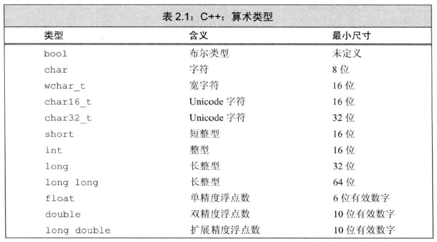
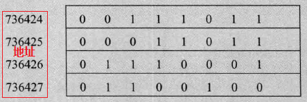
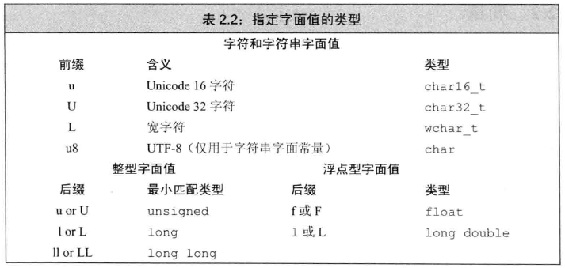
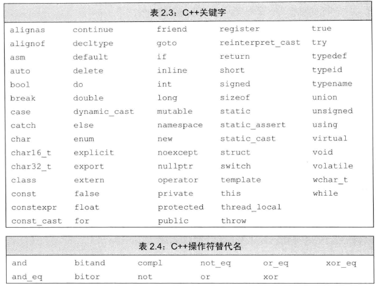

# 变量和基本类型 #

## 基本内置类型 ##

C++定义了一套包括

1. 算术类型arithmetic type
2. 空类型void

### 算术类型 ###

其类型分为两类

1. 整型integral 包括 字符 和 布尔类型 
2. 浮点型

上表列出了C++标准规定的尺寸的最小值，同时允许编译器赋予这些类型更大的尺寸。

C++语言规定一个int至少和一个short一样大，一个long至少和一个int一样大，一个long long至少和一个long一样大。其中，数据类型long long 是在C++11中新定义的。

---

**内置类型的机器实现**

大多数计算机以2的整数次幂个比特作为块来处理内存，可寻址的最小内存块称为“**字节byte**”，存储的基本单元称为“**字word**”，它通常有几个字节组成。

**字节**有8**比特**构成，**字**由32或64**比特**构成，也就是4或8**字节**。

大多数计算机将内存中的**每个字节**与**一个数字**（被称为“地址address”）关联起来，在一个字节为8比特、字为32比特的机器上，内存区域如下所示：

使用**某地址**来**表示**从这个地址开始的大小不同的比特串。如，736424那行字节或字。

---

**为了赋予内存中某个地址明确的含义，必须首先知道存储在该地址的数据的类型。**

类型决定了

1. 数据所占的比特数以及
2. 该如何解释这些比特内容。

**若位置736424处的对象类型是float**，并且该机器中float以32比特存储，那么我们就能知道这个对象的内存占满整个字。整个float数的实际值依赖于该机器是如何存储浮点数。

**若位置736424处的对象类型是unsigned char**，并且该机器使用ISO-Latin-1字符集，则该位置处的字节表示一个分号。

---

浮点数可表示

1. 单精度 float
2. 双精度 double
3. 扩展精度 long double

#### 带符号类型和无符号类型 ####

除去布尔型和扩展的字符型之外，其它整型可以划分为

1. 带符号的signed 可表示正数、负数、0
2. 无符号的unsigned 表示非负数

#### 如何选择合适类型 ####

C++, like C, is designed to let programs get close to the hardware when necessary. The arithmetic types are defined to cater to the peculiarities独特性 of various kinds of hardware. 

Accordingly, the number of arithmetic types in C++ can be bewildering. Most programmers can (and should) **ignore** these complexities by restricting the types they use.

A few rules of thumb can be useful in deciding which type to use:

- Use an `unsigned` type when you know that the values **cannot be negative**.

- Use `int` for integer arithmetic. `short` is usually too small and, in practice, `long` often has the same size as `int`. If your data values are larger than the minimum guaranteed size of an `int`, then use `long long`.

- **Do not use plain `char` or `bool` in arithmetic expressions.** Use them only to hold characters or truth values. Computations using `char` are especially problematic because `char` is `signed` on some machines and unsigned on others. If you need a tiny integer, explicitly specify either `signed char` or `unsigned char`.

- **Use `double` for floating-point computations; `float` usually does not have enough precision, and the cost of double-precision calculations versus single-precision is negligible微不足道的，可以忽略的.** In fact, on some machines, double-precision operations are faster than single. The precision offered by `long double` usually is unnecessary and often entails considerable run-time cost.

### 类型转换 ###

Type Conversions

what happens depends on the range of the values that the types permit:

类型转换|结果
---|---
one of the **nonbool** arithmetic types to a **bool** object|the result is false if the value is 0 and true otherwise
a **bool** to one of the other arithmetic types|the resulting value is 1 if the bool is true and 0 if the bool is false.
a **floating-point** value to an object of **integral** type|the value is truncated. The value that is stored is the part before the decimal point
an **integral** value to an object of **floating-point** type|the fractional part is zero. Precision may be lost if the integer has more bits than the floating-point object can accommodate容纳
an **out-of-range** value to an object of **unsigned** type|the result is the remainder余数 of the value modulo取模 the number of values the target type can hold. **For example**, an 8-bit `unsigned char` can hold values from 0 through 255, inclusive. **If we assign a value outside this range**, the compiler assigns the remainder of that value modulo 256. Therefore, assigning –1 to an 8-bit `unsigned char` gives that object the value 255
an **out-of-range value** to an object of `signed` type|the result is undefined. The program might appear to work, it might crash, or it might produce garbage values.

**避免误会预知和依赖于实现环境的行为**

**programs usually should avoid implementation-defined behavior**, such as assuming that the size of an int is a fixed and known value. Such programs are said to be nonportable. 

When the program is moved to another machine, code that relied on implementation-defined behavior may fail. Tracking down定位 these sorts of problems in previously working programs is, mildly put, unpleasant.

#### 含有无符号类型的表达式 ####

unsigned类型与signed类型，会出现**意外值**

	unsigned u = 10;
	int i = -42;
	std::cout << i + i << std::endl; // prints -84
	std::cout << u + i << std::endl; // if 32-bit ints, prints 4294967264

---

	unsigned u1 = 42, u2 = 10;
	std::cout << u1 - u2 << std::endl; // ok: result is 32
	std::cout << u2 - u1 << std::endl; // ok: but the result will wrap around

---

	//WRONG: u can never be less than 0; the condition will always succeed
	for (unsigned u = 10; u >= 0; --u)
		std::cout << u << std::endl;

	//解决方法改用while
	unsigned u = 11; // start the loop one past the first element we want to print
	while (u > 0) {
		--u; // decrement first, so that the last iteration will print 0
		std::cout << u << std::endl;
	}

**切勿混用带符号类型和无符号类型**

### 字面值常量 ###

literal

#### 整型和浮点型字面量 ####

	20 /* decimal */ 024 /* octal */ 0x14 /* hexadecimal */

	//浮点数
	3.14159 3.14159E0 0. 0e0 .001

#### 字符和字符串字面值 ####

	'a'//字符字面量
	"Hello World!"//字符串字面值

编译器在每个字符串的结尾处添加一个空字符('\0')，因此，字符串字面值的实际长度要比他的内容多1。

字符串分开书写

	// multiline string literal
	std::cout << "a really, really long string literal "
		"that spans two lines" << std::endl;

#### 转义序列 ####

有两类字符不可直接使用

1. 不可打印的，如退格或其他控制字符
2. 转义序列 \n、\t等

泛化的转义序列

	\7 (bell) \12 (newline) \40 (blank)
	\0 (null) \115 ('M') \x4d ('M')

#### 指定字面值的类型 ####

	L'a' // wide character literal, type is wchar_t
	u8"hi!" // utf-8 string literal (utf-8 encodes a Unicode character in 8 bits)
	42ULL // unsigned integer literal, type is unsigned long long
	1E-3F // single-precision floating-point literal, type is float
	3.14159L // extended-precision floating-point literal, type is long double

#### 布尔字面值和指针字面值 ####

true和false是布尔类型的字面值

nullptr是指针字面值。

## 变量 ##

A **variable** provides us with named storage that our programs can manipulate.

Each variable in C++ has a **type**. The type determines the size and layout of the variable’s memory, the range of values that can be stored within that memory, and the set of operations that can be applied to the variable. 

C++ programmers tend to refer to variables as “**variables**” or “**objects**” interchangeably.

### 变量定义 ###

A simple variable definition consists of a **type specifier类型说明符**, followed by a list of one or more variable names separated by commas, and ends with a semicolon.

	int sum = 0, value, // sum, value, and units_sold have type int
	units_sold = 0; // sum and units_sold have initial value 0
	Sales_item item; // item has type Sales_item (see § 1.5.1 (p. 20))
	// string is a library type, representing a variable-length sequence of characters
	std::string book("0-201-78345-X"); // book initialized from string literal

#### 何为对象 ####

**C++ programmers tend to be cavalier in their use of the term object. Most generally, an object is a region of memory that can contain data and has a type.**

Some use the term **object** only to refer to **variables** or **values** of class types. 

Others distinguish between **named** and **unnamed** objects, using the term variable to refer to named objects. 

Still others distinguish between **objects** and **values**, using the term object for data that can be changed by the program and the term **value** for data that are read-only.

**最后，我们认为对象是具有某种类型的内存空间**。

#### 初始值 ####

An object that is **initialized** gets the specified value at the moment it is created.

	// ok: price is defined and initialized before it is used to initialize discount
	double price = 109.99, discount = price * 0.16;
	// ok: call applyDiscount and use the return value to initialize salePrice
	double salePrice = applyDiscount(price, discount);

在C++中，**初始化**不是**赋值**，**初始化**的含义是创建变量时赋予其一个初始值，而**赋值**的含义是把对象的当前值擦除，而一个新值来替代

#### 列表初始化 ####

List Initialization用花括号初始化

	int units_sold = 0;
	int units_sold = {0};
	int units_sold{0};
	int units_sold(0);

	long double ld = 3.1415926536;
	int a{ld}, b = {ld}; // error: narrowing conversion required
	int c(ld), d = ld; // ok: but value will be truncated

#### 默认初始化 ####

When we define a variable without an initializer, the variable is **default initialized**.

Such variables are given the “**default**” value. What that default value is depends on the type of the variable and may also depend on where the variable is defined.

The value of an object of built-in type that is not explicitly initialized depends on where it is defined. Variables defined **outside any function body** are initialized to **zero**.(1)

绝大多数类都支持无须显式初始化而定义对象，这样类提供了合适的默认值。

	std::string empty; // empty implicitly initialized to the empty string
	Sales_item item; // default-initialized Sales_item object

定义于**函数体内**的内置类型的对象如果没有初始化，则其值未定义。(与(1)处的意思相反)类的对象如果没有显示地初始化，则其值由类确定。

**建议初始化每一个内置类型的变量**。虽然并非必须这么做，但如果我们不能确保初始化程序安全，那么这么做不失为一种简单可靠的方法。

### 变量声明和定义的关系 ###

To allow programs to be written in logical parts, C++ supports what is commonly known as **separate compilation分离式编译**. Separate compilation lets us split our programs into several files, each of which can be compiled independently.

When we separate a program into multiple files, we need a way to **share code across those files**（共享跨文件代码）. For example, code defined in one file may need to use a variable defined in another file. As a concrete example, consider `std::cout` and `std::cin`. These are objects defined somewhere in the standard library, yet our programs can use these objects.

To support separate compilation, **C++ distinguishes between declarations声明 and definitions定义.** A **declaration** makes a name known to the program. A file that wants to use a name defined elsewhere includes a declaration for that name. A **definition** creates the associated entity.

A variable **declaration** specifies the type and name of a variable. A variable **definition** is a declaration定义是声明. In addition to specifying the name and type, a **definition** also allocates storage and may provide the variable with an initial value.

定义属于声明，定义比声明多一些东西。

To obtain a **declaration** that is **not** also a **definition**, we add the `extern` keyword and may not provide an explicit initializer:

	extern int i; // declares but does not define i
	int j; // declares and defines j

Any **declaration** that includes an explicit initializer is a **definition**任何包含了**显式初始化**的**声明**即成为**定义**. We can provide an initializer on a variable defined as extern, but doing so overrides the `extern`. An `extern` that has an initializer is a definition:

	extern double pi = 3.1416; // definition//在函数类会发生异常

It is an **error** to provide an initializer on an `extern` inside a function.

变量能且只能被**定义**一次，但是可以被多次**声明**

The distinction between a **declaration** and a **definition** may seem obscure晦涩的 at this point but is actually important. To use a variable in more than one file requires **declarations** that are separate from the variable’s **definition**. 

To use the same variable in multiple files, we must **define** that variable in **one—and only one—file**. 

Other files that use that variable must **declare**—but **not define**—that variable.

#### 静态类型 ####

C++ is a **statically typed静态类型** language, which means that **types are checked at compile time**. The process by which types are checked is referred to as **type checking**.

As we’ve seen, the type of an object constrains the operations that the object can perform. **In C++, the compiler checks whether the operations we write are supported by the types we use.** If we try to do things that the type does not support, the compiler generates an error message and does not produce an executable file.

As our programs get more complicated, **we’ll see that static type checking can help find bugs.** However, a consequence of static checking is that the type of every entity we use must be known to the compiler. As one example, we must declare the type of a variable before we can use that variable.必须声明类型才能使用变量

### 标识符 ###

**Identifiers** in C++ can be composed of letters, digits, and the underscore character.

The language imposes no limit on name length. Identifiers must begin with either a letter or an underscore. 

Identifiers are case-sensitive; upper- and lowercase letters are distinct:大小写敏感

关键字不能作标识符

#### 变量命名规范 ####

- An identifier should give some indication of its meaning.
- Variable names normally are lowercase—`index`, not `Index` or `INDEX`.
- Like `Sales_item`, classes we define usually begin with an uppercase letter.
- Identifiers with multiple words should visually distinguish each word, for example, `student_loan` or `studentLoan`, not `studentloan`.

### 名字的作用域 ###

## 复合类型 ##

