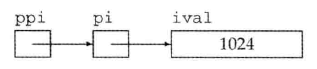

# 变量和基本类型 #

## 基本内置类型 ##

C++定义了一套包括

1. 算术类型arithmetic type
2. 空类型void

### 算术类型 ###

其类型分为两类

1. 整型integral 包括 字符 和 布尔类型 
2. 浮点型

上表列出了C++标准规定的尺寸的最小值，同时允许编译器赋予这些类型更大的尺寸。

C++语言规定一个int至少和一个short一样大，一个long至少和一个int一样大，一个long long至少和一个long一样大。其中，数据类型long long 是在C++11中新定义的。

---

**内置类型的机器实现**

大多数计算机以2的整数次幂个比特作为块来处理内存，可寻址的最小内存块称为“**字节byte**”，存储的基本单元称为“**字word**”，它通常有几个字节组成。

**字节**有8**比特**构成，**字**由32或64**比特**构成，也就是4或8**字节**。

大多数计算机将内存中的**每个字节**与**一个数字**（被称为“地址address”）关联起来，在一个字节为8比特、字为32比特的机器上，内存区域如下所示：

使用**某地址**来**表示**从这个地址开始的大小不同的比特串。如，736424那行字节或字。

---

**为了赋予内存中某个地址明确的含义，必须首先知道存储在该地址的数据的类型。**

类型决定了

1. 数据所占的比特数以及
2. 该如何解释这些比特内容。

**若位置736424处的对象类型是float**，并且该机器中float以32比特存储，那么我们就能知道这个对象的内存占满整个字。整个float数的实际值依赖于该机器是如何存储浮点数。

**若位置736424处的对象类型是unsigned char**，并且该机器使用ISO-Latin-1字符集，则该位置处的字节表示一个分号。

---

浮点数可表示

1. 单精度 float
2. 双精度 double
3. 扩展精度 long double

#### 带符号类型和无符号类型 ####

除去布尔型和扩展的字符型之外，其它整型可以划分为

1. 带符号的signed 可表示正数、负数、0
2. 无符号的unsigned 表示非负数

#### 如何选择合适类型 ####

C++, like C, is designed to let programs get close to the hardware when necessary. The arithmetic types are defined to cater to the peculiarities独特性 of various kinds of hardware. 

Accordingly, the number of arithmetic types in C++ can be bewildering. Most programmers can (and should) **ignore** these complexities by restricting the types they use.

A few rules of thumb can be useful in deciding which type to use:

- Use an `unsigned` type when you know that the values **cannot be negative**.

- Use `int` for integer arithmetic. `short` is usually too small and, in practice, `long` often has the same size as `int`. If your data values are larger than the minimum guaranteed size of an `int`, then use `long long`.

- **Do not use plain `char` or `bool` in arithmetic expressions.** Use them only to hold characters or truth values. Computations using `char` are especially problematic because `char` is `signed` on some machines and unsigned on others. If you need a tiny integer, explicitly specify either `signed char` or `unsigned char`.

- **Use `double` for floating-point computations; `float` usually does not have enough precision, and the cost of double-precision calculations versus single-precision is negligible微不足道的，可以忽略的.** In fact, on some machines, double-precision operations are faster than single. The precision offered by `long double` usually is unnecessary and often entails considerable run-time cost.

### 类型转换 ###

Type Conversions

what happens depends on the range of the values that the types permit:

类型转换|结果
---|---
one of the **nonbool** arithmetic types to a **bool** object|the result is false if the value is 0 and true otherwise
a **bool** to one of the other arithmetic types|the resulting value is 1 if the bool is true and 0 if the bool is false.
a **floating-point** value to an object of **integral** type|the value is truncated. The value that is stored is the part before the decimal point
an **integral** value to an object of **floating-point** type|the fractional part is zero. Precision may be lost if the integer has more bits than the floating-point object can accommodate容纳
an **out-of-range** value to an object of **unsigned** type|the result is the remainder余数 of the value modulo取模 the number of values the target type can hold. **For example**, an 8-bit `unsigned char` can hold values from 0 through 255, inclusive. **If we assign a value outside this range**, the compiler assigns the remainder of that value modulo 256. Therefore, assigning –1 to an 8-bit `unsigned char` gives that object the value 255
an **out-of-range value** to an object of `signed` type|the result is undefined. The program might appear to work, it might crash, or it might produce garbage values.

**避免误会预知和依赖于实现环境的行为**

**programs usually should avoid implementation-defined behavior**, such as assuming that the size of an int is a fixed and known value. Such programs are said to be nonportable. 

When the program is moved to another machine, code that relied on implementation-defined behavior may fail. Tracking down定位 these sorts of problems in previously working programs is, mildly put, unpleasant.

#### 含有无符号类型的表达式 ####

unsigned类型与signed类型，会出现**意外值**

	unsigned u = 10;
	int i = -42;
	std::cout << i + i << std::endl; // prints -84
	std::cout << u + i << std::endl; // if 32-bit ints, prints 4294967264

---

	unsigned u1 = 42, u2 = 10;
	std::cout << u1 - u2 << std::endl; // ok: result is 32
	std::cout << u2 - u1 << std::endl; // ok: but the result will wrap around

---

	//WRONG: u can never be less than 0; the condition will always succeed
	for (unsigned u = 10; u >= 0; --u)
		std::cout << u << std::endl;

	//解决方法改用while
	unsigned u = 11; // start the loop one past the first element we want to print
	while (u > 0) {
		--u; // decrement first, so that the last iteration will print 0
		std::cout << u << std::endl;
	}

**切勿混用带符号类型和无符号类型**

### 字面值常量 ###

literal

#### 整型和浮点型字面量 ####

	20 /* decimal */ 024 /* octal */ 0x14 /* hexadecimal */

	//浮点数
	3.14159 3.14159E0 0. 0e0 .001

#### 字符和字符串字面值 ####

	'a'//字符字面量
	"Hello World!"//字符串字面值

编译器在每个字符串的结尾处添加一个空字符('\0')，因此，字符串字面值的实际长度要比他的内容多1。

字符串分开书写

	// multiline string literal
	std::cout << "a really, really long string literal "
		"that spans two lines" << std::endl;

#### 转义序列 ####

有两类字符不可直接使用

1. 不可打印的，如退格或其他控制字符
2. 转义序列 \n、\t等

泛化的转义序列

	\7 (bell) \12 (newline) \40 (blank)
	\0 (null) \115 ('M') \x4d ('M')

#### 指定字面值的类型 ####

	L'a' // wide character literal, type is wchar_t
	u8"hi!" // utf-8 string literal (utf-8 encodes a Unicode character in 8 bits)
	42ULL // unsigned integer literal, type is unsigned long long
	1E-3F // single-precision floating-point literal, type is float
	3.14159L // extended-precision floating-point literal, type is long double

#### 布尔字面值和指针字面值 ####

true和false是布尔类型的字面值

nullptr是指针字面值。

## 变量 ##

A **variable** provides us with named storage that our programs can manipulate.

Each variable in C++ has a **type**. The type determines the size and layout of the variable’s memory, the range of values that can be stored within that memory, and the set of operations that can be applied to the variable. 

C++ programmers tend to refer to variables as “**variables**” or “**objects**” interchangeably.

### 变量定义 ###

A simple variable definition consists of a **type specifier类型说明符**, followed by a list of one or more variable names separated by commas, and ends with a semicolon.

	int sum = 0, value, // sum, value, and units_sold have type int
	units_sold = 0; // sum and units_sold have initial value 0
	Sales_item item; // item has type Sales_item (see § 1.5.1 (p. 20))
	// string is a library type, representing a variable-length sequence of characters
	std::string book("0-201-78345-X"); // book initialized from string literal

#### 何为对象 ####

**C++ programmers tend to be cavalier in their use of the term object. Most generally, an object is a region of memory that can contain data and has a type.**

Some use the term **object** only to refer to **variables** or **values** of class types. 

Others distinguish between **named** and **unnamed** objects, using the term variable to refer to named objects. 

Still others distinguish between **objects** and **values**, using the term object for data that can be changed by the program and the term **value** for data that are read-only.

**最后，我们认为对象是具有某种类型的内存空间**。

#### 初始值 ####

An object that is **initialized** gets the specified value at the moment it is created.

	// ok: price is defined and initialized before it is used to initialize discount
	double price = 109.99, discount = price * 0.16;
	// ok: call applyDiscount and use the return value to initialize salePrice
	double salePrice = applyDiscount(price, discount);

在C++中，**初始化**不是**赋值**，**初始化**的含义是创建变量时赋予其一个初始值，而**赋值**的含义是把对象的当前值擦除，而一个新值来替代

#### 列表初始化 ####

List Initialization用花括号初始化

	int units_sold = 0;
	int units_sold = {0};
	int units_sold{0};
	int units_sold(0);

	long double ld = 3.1415926536;
	int a{ld}, b = {ld}; // error: narrowing conversion required
	int c(ld), d = ld; // ok: but value will be truncated

#### 默认初始化 ####

When we define a variable without an initializer, the variable is **default initialized**.

Such variables are given the “**default**” value. What that default value is depends on the type of the variable and may also depend on where the variable is defined.

The value of an object of built-in type that is not explicitly initialized depends on where it is defined. Variables defined **outside any function body** are initialized to **zero**.(1)

绝大多数类都支持无须显式初始化而定义对象，这样类提供了合适的默认值。

	std::string empty; // empty implicitly initialized to the empty string
	Sales_item item; // default-initialized Sales_item object

定义于**函数体内**的内置类型的对象如果没有初始化，则其值未定义。(与(1)处的意思相反)类的对象如果没有显示地初始化，则其值由类确定。

**建议初始化每一个内置类型的变量**。虽然并非必须这么做，但如果我们不能确保初始化程序安全，那么这么做不失为一种简单可靠的方法。

### 变量声明和定义的关系 ###

To allow programs to be written in logical parts, C++ supports what is commonly known as **separate compilation分离式编译**. Separate compilation lets us split our programs into several files, each of which can be compiled independently.

When we separate a program into multiple files, we need a way to **share code across those files**（共享跨文件代码）. For example, code defined in one file may need to use a variable defined in another file. As a concrete example, consider `std::cout` and `std::cin`. These are objects defined somewhere in the standard library, yet our programs can use these objects.

To support separate compilation, **C++ distinguishes between declarations声明 and definitions定义.** A **declaration** makes a name known to the program. A file that wants to use a name defined elsewhere includes a declaration for that name. A **definition** creates the associated entity.

A variable **declaration** specifies the type and name of a variable. A variable **definition** is a declaration定义是声明. In addition to specifying the name and type, a **definition** also allocates storage and may provide the variable with an initial value.

定义属于声明，定义比声明多一些东西。

To obtain a **declaration** that is **not** also a **definition**, we add the `extern` keyword and may not provide an explicit initializer:

	extern int i; // declares but does not define i
	int j; // declares and defines j

Any **declaration** that includes an explicit initializer is a **definition**任何包含了**显式初始化**的**声明**即成为**定义**. We can provide an initializer on a variable defined as extern, but doing so overrides the `extern`. An `extern` that has an initializer is a definition:

	extern double pi = 3.1416; // definition//在函数内会发生异常

It is an **error** to provide an initializer on an `extern` inside a function.

变量能且只能被**定义**一次，但是可以被多次**声明**

The distinction between a **declaration** and a **definition** may seem obscure晦涩的 at this point but is actually important. To use a variable in more than one file requires **declarations** that are separate from the variable’s **definition**. 

To use the same variable in multiple files, we must **define** that variable in **one—and only one—file**. 

Other files that use that variable must **declare**—but **not define**—that variable.

#### 静态类型 ####

C++ is a **statically typed静态类型** language, which means that **types are checked at compile time**. The process by which types are checked is referred to as **type checking**.

As we’ve seen, the type of an object constrains the operations that the object can perform. **In C++, the compiler checks whether the operations we write are supported by the types we use.** If we try to do things that the type does not support, the compiler generates an error message and does not produce an executable file.

As our programs get more complicated, **we’ll see that static type checking can help find bugs.** However, a consequence of static checking is that the type of every entity we use must be known to the compiler. As one example, we must declare the type of a variable before we can use that variable.必须声明类型才能使用变量

### 标识符 ###

**Identifiers** in C++ can be composed of letters, digits, and the underscore character.

The language imposes no limit on name length. Identifiers must begin with either a letter or an underscore. 

Identifiers are case-sensitive; upper- and lowercase letters are distinct:大小写敏感

关键字不能作标识符

#### 变量命名规范 ####

- An identifier should give some indication of its meaning.
- Variable names normally are lowercase—`index`, not `Index` or `INDEX`.
- Like `Sales_item`, classes we define usually begin with an uppercase letter.
- Identifiers with multiple words should visually distinguish each word, for example, `student_loan` or `studentLoan`, not `studentloan`.

### 名字的作用域 ###

无论是在程序的什么位置，使用到的每个名字都会指向一个特定的实体：变量、函数、类型等。**然而，同一个名字如果出现在程序的不同位置，也可能指向的是不同的实体**。

	#include <iostream>
	int main()
	{
		int sum = 0;
		// sum values from 1 through 10 inclusive
		for (int val = 1; val <= 10; ++val)
			sum += val; // equivalent to sum = sum + val
		std::cout << "Sum of 1 to 10 inclusive is "
				<< sum << std::endl;
		return 0;
	}

名字main定义所有花括号之外，它和其他大多数定义在函数体之外的名字一样拥有**全局作用域global scope**。一旦声明之后，全局作用域内的名字在整个程序的范围内都可使用。

名字sum定义main函数所限定的作用域之内，从声明sum开始直到main函数结束为止都可以访问它，但是出了main函数所在的块就无法访问了，因此说变量sum拥有**块作用域block scope**。

**建议：当你第一次使用变量时再定义它**

#### 嵌套作用域 ####

作用域能彼此包含，被包含（嵌套）的作用域为**内层作用域inner scope**，包含着别的作用域的作用域为**外层作用域outer scope**。

作用域中一旦声明了某个名字，它所嵌套着的所有作用域中都能访问该名字。同时，允许在内层作用域中重新定义外层作用域已有的名字：

	#include <iostream>
	// Program for illustration purposes only: It is bad style for a function
	// to use a global variable and also define a local variable with the same name
	int reused = 42; // reused has global scope
	int main()
	{
		int unique = 0; // unique has block scope
		// output #1: uses global reused; prints 42 0
		std::cout << reused << " " << unique << std::endl;

		int reused = 0; // new, local object named reused hides global reused 局部的覆盖全局的
		// output #2: uses local reused; prints 0 0
		std::cout << reused << " " << unique << std::endl;

		// output #3: explicitly requests the global reused; prints 42 0 突破局部覆盖访问全局
		std::cout << ::reused << " " << unique << std::endl;
		return 0;
	}

**如果函数有可能用到某全局变量，则不宜再定义一个同名的局部变量。**

## 复合类型 ##

compound type是指基于其他类型定义的类型。

C++语言有几个复合类型，如 引用reference 和 指针pointer。

一条声明语句由一个**基本数据类型base type**和紧随其后的一个**声明符declarator**列表组成的。每个**声明符**命名了一个变量并指定该变量为与基本数据类型有关的某种类型。

### 引用 ###

引用reference为对象起了另外一个名字，引用类型**引用refers to** 另外一种类型。通过将声明符写成&d的形式来**定义引用类型**，其中d是声明的变量名：

	int ival = 1024;
	int &refVal = ival; // refVal refers to (is another name for) ival
	int &refVal2; // error: a reference must be initialized

一般在初始化变量是，初始值会被拷贝到新建的对象。然而定义引用时，程序把引用和它的初始值**绑定bind**在一起，而**不是将初始值拷贝给引用**。

一旦初始化完成，引用将和它的初始化对象一直绑定在一起。因为无法令引用重新绑定到另外一个对象，因此**引用必须初始化**。

#### 引用即别名 ####

**引用并非对象**，相反的，他只是为一个已经存在的对象所起的另外一个名字

定义一个引用后，对其进行的所有操作都是在与之绑定的对象上进行的。

	int ival = 1024;
	int &refVal = ival; // refVal refers to (is another name for) ival
	refVal = 2; // assigns 2 to the object to which refVal refers, i.e., to ival
	int ii = refVal; // same as ii = ival

	// ok: refVal3 is bound to the object to which refVal is bound, i.e., to ival
	int &refVal3 = refVal;
	
	// initializes i from the value in the object to which refVal is bound
	int i = refVal; // ok: initializes i to the same value as ival

#### 引用定义 ####

允许在一条语句中定义多个引用，其中每个引用标识符都必须以符号&开头：

	int i = 1024, i2 = 2048; // i and i2 are both ints
	int &r = i, r2 = i2; // r is a reference bound to i; r2 is an int
	int i3 = 1024, &ri = i3; // i3 is an int; ri is a reference bound to i3
	int &r3 = i3, &r4 = i2; // both r3 and r4 are references

	int &refVal4 = 10; // error: initializer must be an object
	double dval = 3.14;
	int &refVal5 = dval; // error: initializer must be an int object

### 指针 ###

pointer是指向point to另外一种类型的复合类型。

与reference类似的是也实现了对其他对象的间接对象。

与reference不同的：

1. 指针本身就是一个对象，允许对指针赋值和拷贝，而且在指针的生命周期类它可以先后指向几个不同的对象。
2. 指针无须在定义时赋初值。和其他内置类型一样，在块作用域内定义的指针如果没有被初始化，也将拥有一个不确定的值。

>**Warning**
>
>Pointers are often hard to understands. Debugging problems due to pointer errors bedevil even experienced programmers.

	int *ip1, *ip2; // both ip1 and ip2 are pointers to int
	double dp, *dp2; // dp2 is a pointer to double; dp is a double

#### 获取对象的地址 ####

指针存放某个对象的地址，要获取该地址，需要使用**取地址符&**

	int ival = 42;
	int *p = &ival; // p holds the address of ival; p is a pointer to ival

	double dval;
	double *pd = &dval; // ok: initializer is the address of a double
	double *pd2 = pd; // ok: initializer is a pointer to double
	int *pi = pd; // error: types of pi and pd differ
	pi = &dval; // error: assigning the address of a double to a pointer to int

因为引用不是对象，没有实际地址，所以不能定义指向引用的指针。

#### 指针值 ####

指针的值（即地址）应属下列4种状态之一：

1. 指向一个对象
2. 指向紧邻对象所占空间的下一个位置。
3. 空指针，意味着指针没有指向任何对象。
4. 无效指针，也就是上述情况之外的其他值。

#### 利用指针访问对象 ####

若指针指向了一个对象，则允许使用** 解引用符\* **来访问该对象

	int ival = 42;
	int *p = &ival; // p holds the address of ival; p is a pointer to ival
	cout << *p; // * yields the object to which p points; prints 42

	*p = 0; // * yields the object; we assign a new value to ival through p
	cout << *p; // prints 0

**解引用操作仅适用于那些确实指向了某个对象的有效指针。**

#### 某些符号有多重含义 ####

像 & 和 * 这样的符号，既能用作表达式里的运算符，也能作为声明的一部分出现，符号的上下文决定了符号的意义。

	int i = 42;
	int &r = i; // & follows a type and is part of a declaration; r is a
	reference
	int *p; // * follows a type and is part of a declaration; p is a
	pointer
	p = &i; // & is used in an expression as the address-of operator
	*p = i; // * is used in an expression as the dereference operator
	int &r2 = *p; // & is part of the declaration; * is the dereference operator

#### 空指针 ####

null pointer不指向任何对象，在试图使用一个指针之前代码可以首先检查它是否为空。

	int *p1 = nullptr; // equivalent to int *p1 = 0;
	int *p2 = 0; // directly initializes p2 from the literal constant 0

	// must #include cstdlib
	int *p3 = NULL; // equivalent to int *p3 = 0;

`nullptr`，是C++11新标准刚刚引入的一种方法。

过去NULL的**预处理变量preprocessor variable**，它的值相当于0。

现在C++程序最好使用`nullptr`，同时尽量避免使用NULL.

把int变量直接赋给指针是错误的操作，即使int变量的值恰好等于0也不行。

	int zero = 0;
	pi = zero; // error: cannot assign an int to a pointer

#### 建议：初始化所有指针 ####

建议初始化所有的指针，并且可能的情况下，尽量等定义了对象之后再定义指向它的指针。 如果实在不清楚指针应该指向何处，就把它初始化为nullptr或者0，这样程序就能检测并知道它没有指向任何具体的对象了。

#### 赋值和指针 ####

指针和引用都能提供对其他对象的间接访问，然而在具体实现细节上两者有很大不同，其中最重要的一点就是**引用本身并非一个对象**。

一旦定义了引用，就**无法**令其再绑定到另外的对象，之后每次使用这个引用都是访问它最初绑定的那个对象。

指针和它存放的地址之间就没有这种限制了。和其他任何变量（只要不是引用）一样，给指针赋值就是令它存放一个新的对象。

	int i = 42;
	int *pi = 0; // pi is initialized but addresses no object
	int *pi2 = &i; // pi2 initialized to hold the address of i
	int *pi3; // if pi3 is defined inside a block, pi3 is uninitialized
	pi3 = pi2; // pi3 and pi2 address the same object, e.g., i
	pi2 = 0; // pi2 now addresses no object

有时要搞清楚一条赋值语句到底是改变了指针的值还是改变了指针所指对象的值不太容易，**最好的办法就是记住赋值永远改变的是等号左侧的对象**。

	pi = &ival; // value in pi is changed; pi now points to ival

	*pi = 0; // value in ival is changed; pi is unchanged;*pi（也就是指针pi指向的那个对象）发生改变。

#### 其他指针操作 ####

只要指针拥有一个合法值，就能将它用在条件表达式。和采用算术值作为条件遵循的规则类似，如果指针的值是0，条件取false；任何非0指针对应的条件值都是true，任何非0指针对应的条件值都是true。

	int ival = 1024;
	int *pi = 0; // pi is a valid, null pointer
	int *pi2 = &ival; // pi2 is a valid pointer that holds the address of ival

	if (pi) // pi has value 0, so condition evaluates as false
		// ...
	if (pi2) // pi2 points to ival, so it is not 0; the condition evaluates as true
		// ...

对于两个类型相同的合法指针，可以用相等操作符（==）或不相等操作符（!=）来比较它们的地址值。相等，则true。不相等，则false。

#### void*指针 ####

`void*`是一种特殊的指针类型，可用于存放任意对象的地址。一个void*指针存放着一个地址，与其他指针类似。

不同的是，我们对该地址中到底是个什么类型的对象并不了解。

	double obj = 3.14, *pd = &obj;
	// ok: void* can hold the address value of any data pointer type
	void *pv = &obj; // obj can be an object of any type
	pv = pd; // pv can hold a pointer to any type

利用`void*`指针能做的事比较有限：

1. 拿它和别的指针比较
2. 作为函数的输入或输出
3. 赋给另外一个`void*`指针

不能直接操作void*指针所指的对象，因为我们并不知道这个对象到底是什么类型，也无法确定能在这个对象上做哪些操作。

### 理解复合类型的声明 ###

变量的定义包括一个**基本数据类型base type**和一组声明符。在同一条定义语句中，虽然基本类型只有一个，但是声明符的形式却可以不同。即，一条定义语句可能定义出不同类型的变量：

	// i is an int; p is a pointer to int; r is a reference to int
	int i = 1024, *p = &i, &r = i;

#### 定义多个变量 ####

经常有一种观点会误以为，在定义语句中，类型修饰符（*或&）作用域本次定义的全部变量。

我们把空格写在类型修饰符和变量名中间：

	int* p;//合法但是容易产生误导

其实，基本类型是int而非int*。*仅仅修饰p而已，对该声明语句中的其他变量，它并不产生任何作用：

	int* p1, p2; // p1 is a pointer to int; p2 is an int

涉及指针或引用的声明，一般有两种写法。

1.把修饰符和变量标识符写在一起

	int *p1, *p2; // both p1 and p2 are pointers to int

2.把修饰符和类型名写在一起，并且每条语句只定义一个变量

	int* p1; // p1 is a pointer to int
	int* p2; // p2 is a pointer to int

**建议：将*（或是&）与变量名连在一起**

#### 指向指针的指针 ####

指针是内存中的对象，像其他对象一样也有自己的地址，因此允许把指针的地址再存放到另一个指针当中。

通过*的个数区分指针的级别。

`**`表示指向指针的指针。

`***`表示指向指针的指针的指针。

	int ival = 1024;
	int *pi = &ival; // pi points to an int
	int **ppi = &pi; // ppi points to a pointer to an int

为了访问最原始的那个对象，需要对指针的指针做两次解引用：

	cout << "The value of ival\n"
		<< "direct value: " << ival << "\n"
		<< "indirect value: " << *pi << "\n"
		<< "doubly indirect value: " << **ppi
		<< endl;

#### 指向指针的引用 ####

**引用本身不是一个对象，因此不能定义指向引用的指针。**但指针是对象，所以存在对指针的引用：

	int i = 42;
	int *p; // p is a pointer to int
	int *&r = p; // r is a reference to the pointer p
	r = &i; // r refers to a pointer; assigning &i to r makes p point to i
	*r = 0; // dereferencing r yields i, the object to which p points; changes i to 0

要理解r的类型到底是什么，最简单的办法是**从右向左阅读r的定义**。离变量名最近的符号对变量类型有最直接影响，如`int *&r = p;` ，`&r`，因此，r是一个引用。声明符的其余部分用以确定r引用的类型是什么，此例中的符号*说明r引用的是一个指针。最后，声明的基本类型部分指出r引用的是一个int指针。Finally, the base type of the declaration says that r is a reference to a pointer to an int.

## const限定符 ##

>PS.类似Java的final修饰变量

有时希望定义这样一种变量，它的值不能被改变。

例如，用一个变量来表示缓冲区的大小。使用变量的好处是当我们觉得缓冲区大小不再合适时，很容易对其进行调整。

另一方面，也随时警惕防止程序一不小心改变了这个值。

因此，使用关键字`const`对变量的类型加以限定：

	const int bufSize = 512; // input buffer size

	bufSize = 512; // error: attempt to write to const object

const对象一旦创建后其值就不能再改变，所以对象必须初始化。

	const int i = get_size(); // ok: initialized at run time
	const int j = 42; // ok: initialized at compile time
	const int k; // error: k is uninitialized const

#### 初始化和const ####

与非const类型所能参与的操作相比，const类型的对象能完成其中大部分，但不是所有操作适合。主要限制就是只能在const类型的对象上执行不改变其内容的操作。

	int i = 42;
	const int ci = i; // ok: the value in i is copied into ci
	int j = ci; // ok: the value in ci is copied into j

#### 默认状态下，const对象仅在文件内有效 ####

	const int bufSize = 512; // input buffer size

编译器将在编译过程中把用到该变量的地方都替换成对应的值。

若进行替换，编译器必须知道变量的初始值。若程序包含多个文件，则每个用了const对象的文件都必须得能访问到它的初始值才行。

为了支持这一用法，同时避免同一变量的重复定义，**默认情况下，const对象被设定为仅在文件内有效。**当多个文件中出现了同名的const变量时，其实等同于在不同文件中分别定义了独立的变量。

解决方法如下：

	// file_1.cc defines and initializes a const that is accessible to other files
	extern const int bufSize = fcn();

	// file_1.h
	extern const int bufSize; // same bufSize as defined in file_1.cc

file1_1.h头文件中的声明也由extern做了限定，其作用是**指明bufSize并非本文件所独有，它的定义将在别处出现**。

**如果想在多个文件之间共享const对象，必须在变量的定义之前添加extern关键字。**

### const的引用 ###

可以把引用绑定到const对象上，就像绑定到其他对象上一样，称之为**对常量的引用reference to const**。与普通引用不同的是，对常量的引用不能被用作修改它所绑定的对象。

	const int ci = 1024;
	const int &r1 = ci; // ok: both reference and underlying object are const
	r1 = 42; // error: r1 is a reference to const
	int &r2 = ci; // error: non const reference to a const object

**术语：常量是对const的引用**

#### 初始化和对const的引用 ####

允许为一个常量引用绑定非常量的对象、字面量，甚至是个一般表达式：

	int i = 42;
	const int &r1 = i; // we can bind a const int& to a plain int object
	const int &r2 = 42; // ok: r1 is a reference to const
	const int &r3 = r1 * 2; // ok: r3 is a reference to const
	int &r4 = r * 2; // error: r4 is a plain, non const reference

---

	double dval = 3.14;
	const int &ri = dval;

为了使上述代码工作，编译器把上述代码变成了如下形式：

	const int temp = dval; // create a temporary const int from the double
	const int &ri = temp; // bind ri to that temporary

在这种情况下，ri绑定了一个**临时量temporary**

程序员既然让ri引用dval，就肯定想通过ri改变dval的值，否则为什么要给ri赋值呢？因此，上述行为被C++归为非法。

#### 对const的引用可能引用一个并非const的对象 ####

	int i = 42;
	int &r1 = i; // r1 bound to i
	const int &r2 = i; // r2 also bound to i; but cannot be used to change i
	r1 = 0; // r1 is not const; i is now 0
	r2 = 0; // error: r2 is a reference to const

### 指针和const ###

**指向常量的指针pointer to const**不能用于改变其所指对象的值。要想存放常量对象的地址，只能够使用指向常量的指针。

	const double pi = 3.14; // pi is const; its value may not be changed
	double *ptr = &pi; // error: ptr is a plain pointer
	const double *cptr = &pi; // ok: cptr may point to a double that is const
	*cptr = 42; // error: cannot assign to *cptr

---

指针的类型必须与其所指对象的类型一致。但是有**例外**，是允许令一个指向常量的指针指向一个非常量对象。

	double dval = 3.14; // dval is a double; its value can be changed
	cptr = &dval; // ok: but can't change dval through cptr

试想：所谓指向常量的指针或引用，不过是指针或引用“自以为是”罢了，它们觉得自己指向了常量，所以自觉地不去改变所指对象的值。

#### const指针 ####

**指针是对象而引用不是**，因此就像其他对象类型一样，允许把指针本身定为常量。

常量指针const pointer必须初始化，而且一旦初始化完成，则它的值（也就是存放在指针中的那个地址）就不能再改变了。

把`*`放在const关键字之前用以说明指针是一个常量，这样的书写形式隐含着一层意味，即**不变的是指针本身的值**而非指向的那个值：

	int errNumb = 0;
	int *const curErr = &errNumb; // curErr will always point to errNumb
	
	const double pi = 3.14159;
	const double *const pip = &pi; // pip is a const pointer to a const object

**想要弄清楚这些声明的含义最行之有效的办法是从右向左阅读。**

指针本身是一个常量并不意味着不能通过指针修改其所指对象的值，能否这样做完全依赖于所指对象的类型。

	*pip = 2.72; // error: pip is a pointer to const
	// if the object to which curErr points (i.e., errNumb) is nonzero

	if (*curErr) {
		errorHandler();
		*curErr = 0; // ok: reset the value of the object to which curErr is bound
	}

### 顶层const ##

指针本身是一个对象，它又可以指向另外一个对象。

因此，**指针本身是不是常量** 以及 **指针所指的是不是一个常量** 就是两个相互独立的问题。

**顶层const** (top-level const)表示指针本身是个常量。

**底层const** (low-level const)表示指针所指的对象是一个常量。

更一般的，**顶层const**可以表示任意的对象是常量，这一点对任何数据类型都适用，如算术类型、类、指针等。

**底层const**则与指针和引用等复合类型的基本类型部分有关。

特殊的是，**指针类型**既可以是顶层const也可以是底层const

	int i = 0;
	int *const p1 = &i; // we can't change the value of p1; const is top-level
	const int ci = 42; // we cannot change ci; const is top-level//??? Is ci a pointer?
	
	const int *p2 = &ci; // we can change p2; const is low-level
	const int &r = ci; // const in reference types is always low-level

	const int *const p3 = p2; // right-most const is top-level, left-most is not

---

	i = ci; // ok: copying the value of ci; top-level const in ci is ignored
	p2 = p3; // ok: pointed-to type matches; top-level const in p3 is ignored

执行拷贝操作并不会改变被拷贝对象的值，因此，拷入和拷出的对象是否是常量都没什么影响。

当执行对象的拷贝操作时，拷入和拷出的对象必须具有相同的底层const资格，或者两个对象的数据类型必须能够转换。

	int *p = p3; // error: p3 has a low-level const but p doesn't
	p2 = p3; // ok: p2 has the same low-level const qualification as p3
	p2 = &i; // ok: we can convert int* to const int*
	int &r = ci; // error: can't bind an ordinary int& to a const int object
	const int &r2 = i; // ok: can bind const int& to plain int

### constexpr和常量表达式 ###

C++ 新标准规定，允许声明为`constexpr`类型以便有编译器来验证变量的值是否是一个常量表达式。

声明为constexpr的变量一定是一个常量，而且必须用常量表达式初始化：

	const int max_files = 20; // max_files is a constant expression
	const int limit = max_files + 1; // limit is a constant expression
	int staff_size = 27; // staff_size is not a constant expression
	const int sz = get_size(); // sz is not a constant expression

最佳实践：一般来说，如果认定变量是一个常量表达式，那就把它声明成`constexpr`类型

#### 字面值类型 ####

常量表达式的值需要在编译时就得到计算，因此对声明constexpr时用到的类型必须有所限制。因为这些类型一般比较简单，值显而易见，就称之为 **字面值类型literal type**。

算术类型、引用和指针都属于字面值类型。自定义类、IO库、string类型则不属于字面值类型，也就不能被定义为constexpr。

尽管指针和引用都能定义为constexpr，但它们的初始值却手到严格限制。一个constexpr指针的初始值必须是nullptr或者0，或者是存储于某个固定地址中的对象。

#### 指针和constexpr ####

必须明确一点，在constexpr声明中如果定义了一个指针，限定符constexpr仅对指针有效，与指针所指对象无关：

	const int *p = nullptr; // p is a pointer to a const int
	constexpr int *q = nullptr; // q is a const pointer to int

p和q类型相差甚远，p是一个指向常量的指针，而q是一个常量指针，其中的关键在于constexpr把它所定义的对象置为了顶层const。

	constexpr int *np = nullptr; // np is a constant pointer to int that is null
	int j = 0;
	constexpr int i = 42; // type of i is const int
	
	// i and j must be defined outside any function
	constexpr const int *p = &i; // p is a constant pointer to the const int i
	constexpr int *p1 = &j; // p1 is a constant pointer to the int j

## 处理类型 ##

### 类型别名 ###

**类型别名type alias** 是一个名字，它是某种类型的同义词。使用类型别名的好处能让复杂类型名字简单明了。

有**两种方法**可用于定义类型别名。

1.使用关键字typedef

	typedef double wages; // wages is a synonym for double
	typedef wages base, *p; // base is a synonym for double, p for double*

2.新规定，使用**别名声明alias declaration**来定义类型的别名，使用关键字using。

	using SI = Sales_item; // SI is a synonym for Sales_item

类型别名和类型的名字等价，只要是类型的名字能出现的地方，就使用类型别名。

	wages hourly, weekly; // same as double hourly, weekly;
	SI item; // same as Sales_item item

#### 指针、常量和类型别名 ####

如果某个类型别名指代的是复合类型或常量，那么把它用到声明语句里就会产生意想不到的后果。

	typedef char *pstring;
	const pstring cstr = 0; // cstr is a constant pointer to char 
	const pstring *ps; // ps is a pointer to a constant pointer to char

遇到一条使用了声明类型语句时，错误理解为：

	const char *cstr = 0; // wrong interpretation of const pstring cstr

声明语句用到 pstring时，其基本数据类型是指针。

可是用`char*`重写了声明语句后，数据类型就变成了char，*称为了声明符的一部分。

这样改写的结果是，const char成了基本数据类型。

前后两种声明含义截然不同，**前者**声明了一个指向char的常量指针，**后者**改写的形式则声明了指向const char 的指针。

>PS. 好麻烦啊~

### auto类型说明符 ###

