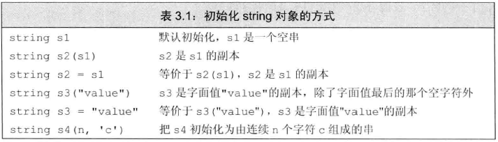
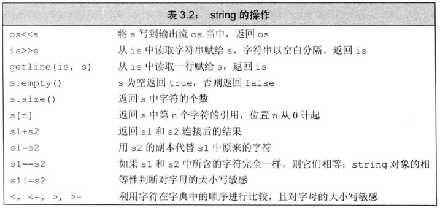
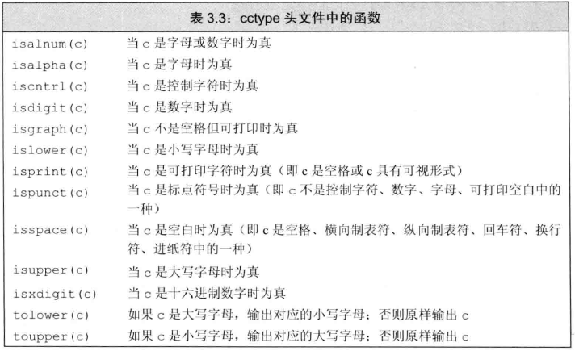
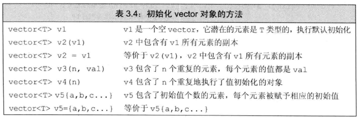
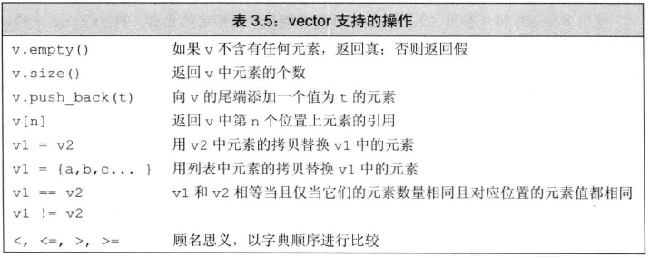
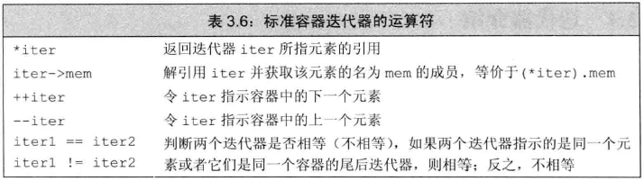
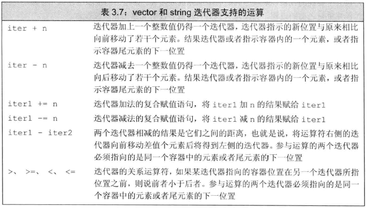
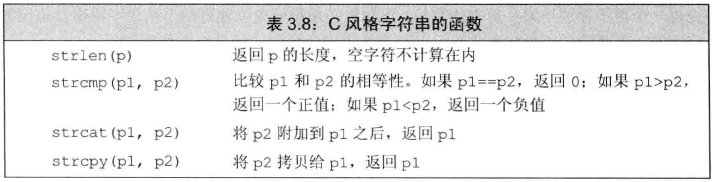

# 字符串、向量和数组 #

## 命名空间的using声明 ##

using declaration

	using namespace::name;

一旦声明了上述语句，就可以直接访问命名空间中的名字

	#include <iostream>
	// using declaration; when we use the name cin, we get the one from the namespace std
	using std::cin;
	int main()
	{
		int i;
		cin >> i; // ok: cin is a synonym for std::cin
		cout << i; // error: no using declaration; we must use the full name
		std::cout << i; // ok: explicitly use cout from namepsace std
		return 0;
	}

### 每个名字都需要独立的using声明 ###

每个声明引入命名空间中的一个成员

	#include <iostream>
	// using declarations for names from the standard library
	using std::cin;
	using std::cout; using std::endl;
	
	int main()
	{
		cout << "Enter two numbers:" << endl;
		int v1, v2;
		cin >> v1 >> v2;
		cout << "The sum of " << v1 << " and " << v2
		<< " is " << v1 + v2 << endl;
		return 0;
	}

一开始就有对`cin`、`cout`和`endl`的using声明，这意味着我们不再添加`std::`形式的前缀就能直接使用它们。

### 头文件不应该包含using声明 ###

有可能产生始料未及的名字冲突。

## 标准库类型string ##

标准库类型string表示可变长的字符序列，使用string类型必须首先包含string头文件

	#include <string>
	using std::string;

### 定义和初始化string对象 ###

初始化string对象常用方式

	string s1; // default initialization; s1 is the empty string
	string s2 = s1; // s2 is a copy of s1
	string s3 = "hiya"; // s3 is a copy of the string literal
	string s4(10, 'c'); // s4 is cccccccccc

### 直接初始化和拷贝初始化 ###

若使用等号=初始化一个变量，实际上执行的是**拷贝初始化copy initialization**，编译器把等号右侧的初始值拷贝到新创建的对象中去。

与之相反，若不使用等号，则执行的是**直接初始化direct initialization**。

	string s5 = "hiya"; // copy initialization
	string s6("hiya"); // direct initialization
	string s7(10, 'c'); // direct initialization; s7 is cccccccccc

	string s8 = string(10, 'c'); // copy initialization; s8 is cccccccccc
	//本质等于
	string temp(10, 'c'); // temp is cccccccccc
	string s8 = temp; // copy temp into s8

>PS.两个初始化有何差别，书上没说。

### string对象上的操作 ###

### 读写string对象 ###

	// Note: #include and using declarations must be added to compile this code
	int main()
	{
		string s; // empty string
		cin >> s; // read a whitespace-separated string into s
		cout << s << endl; // write s to the output
		return 0;
	}

在执行读取操作时，string对象会自动忽略开头的空白（即空格符、换行符、制表符）并从第一个真正的字符开始读起，直到遇见下一处空白为止。

So, if the input to this program is `Hello World!` (note leading and trailing spaces), then the output will be `Hello` with no extra spaces.

Like the input and output operations on the built-in types, the string operators return their left-hand operand as their result. Thus, we can chain together multiple reads or writes

	string s1, s2;
	cin >> s1 >> s2; // read first input into s1, second into s2
	cout << s1 << s2 << endl; // write both strings

If we give this version of the program the same input, `Hello World!`, our output would be “`HelloWorld!`”

### 读取未知数量的string对象 ###

	int main()
	{
		string word;

		//重复若干次后，一旦遇到文件结束标记或非法输入循环也就结束了
		while (cin >> word) // read until end-of-file
			cout << word << endl; // write each word followed by a new line
		return 0;
	}

### 使用getline读取一整行 ###

有时希望能最终得到的字符串中保留输入时的空白符，这时应该用`getline()`代替`>>`运算符。

getline()的参数是一个输入流和一个string对象，函数从给定的输入流中读入内容，直到遇到换行符为止（注意换行符也被读进来），然后把所读的内容存入到那个string对象中去（注意不存换行符）。

	int main()
	{
		string line;
		// read input a line at a time until end-of-file
		while (getline(cin, line))
		cout << line << endl;
		return 0;
	}

### string的empty和size操作 ###

empty()根据string对象是否为空返回一个对应的布尔值。

	// read input a line at a time and discard blank lines
	while (getline(cin, line))
	if (!line.empty())
		cout << line << endl;

size()返回string对象的长度。

	string line;
	// read input a line at a time and print lines that are longer than 80 characters
	while (getline(cin, line))
		if (line.size() > 80)
			cout << line << endl;

### string::size_type类型 ###

size()返回的是一个string::size_type类型的值。

可推断，它是无符号整型。

C++新标准中，允许编译器auto或者decltype来推断变量的类型

	auto len = line.size(); // len has type string::size_type

切记，若表达式中混用了带符号数和无符号数将可能产生意想不到结果。例如，假如n是一个具有负值的`int`，则表达式`s.size()<n`的判断结果几乎肯定是`true`。因为负值n自动地转换成一个比较大无符号值。

### 比较string对象 ###

The equality operators (== and !=) test whether two strings are **equal** or **unequal**, respectively.

The relational operators <, <=, >, >= test whether one string is **less than**, **less than or equal to**, **greater than**, or **greater than or equal to** another.

These operators use the same strategy as a (case-sensitive) **dictionary**:

1. If two strings have different lengths and if every character in the shorter string is equal to the corresponding character of the longer string, then the shorter string is **less than** the longer one.

2. If any characters at corresponding positions in the two strings differ, then the result of the string comparison is the result of comparing the first character at which the strings differ.

---

	string str = "Hello";
	string phrase = "Hello World";
	string slang = "Hiya";

Using rule 1, we see that `str` is less than `phrase`. By applying rule 2, we see that `slang` is greater than both `str` and `phrase`.

### 为string对象赋值 ###

	string st1(10, 'c'), st2; // st1 is cccccccccc; st2 is an empty string
	st1 = st2; // assignment: replace contents of st1 with a copy of st2
				// both st1 and st2 are now the empty string

### 两个string对象相加 ###

	string s1 = "hello, ", s2 = "world\n";
	string s3 = s1 + s2; // s3 is hello, world\n
	s1 += s2; // equivalent to s1 = s1 + s2

### 字面值和string对象相加 ###

因为某些历史原因，也为了与C兼容，所以**C++语言中的字符串字面量**不是**标准库类型string的对象**。**切记**，字符串字面值与string是不同的类型。

**字符串字面量不能直接相加**

	string s1 = "hello", s2 = "world"; // no punctuation in s1 or s2
	string s3 = s1 + ", " + s2 + '\n';

	string s4 = s1 + ", "; // ok: adding a string and a literal
	string s5 = "hello" + ", "; // error: no string operand
	string s6 = s1 + ", " + "world"; // ok: each + has a string operand
	string s7 = "hello" + ", " + s2; // error: can't add string literals

---

	string s6 = (s1 + ", ") + "world";

	//等价于

	string tmp = s1 + ", "; // ok: + has a string operand
	s6 = tmp + "world"; // ok: + has a string operand

	string s7 = ("hello" + ", ") + s2; // error: can't add string literals

### 处理string对象中的字符 ###

**建议**：使用C++版本的C标准库头文件

#### 处理每个字符？使用基于范围的for语句 ####

使用C++11新标准提供的一种语句：**范围for（range for）**

	for (declaration : expression)
		statement

---

	//使用示例
	string str("some string");

	// print the characters in str one character to a line
	for (auto c : str) // for every char in str
		cout << c << endl; // print the current character followed by a newline

---

	string s("Hello World!!!");

	// punct_cnt has the same type that s.size returns; 
	decltype(s.size()) punct_cnt = 0;

	// count the number of punctuation characters in s
	for (auto c : s) // for every char in s
		if (ispunct(c)) // if the character is punctuation
			++punct_cnt; // increment the punctuation counter

	cout << punct_cnt << " punctuation characters in " << s << endl;

输出结果

	3 punctuation characters in Hello World!!!

#### 使用范围for语句改变字符串中的字符 ####

若想改变string对象中的字符的值，必须把循环变量定义成引用类型。

	string s("Hello World!!!");
	// convert s to uppercase
	for (auto &c : s) // for every char in s (note: c is a reference)
		c = toupper(c); // c is a reference, so the assignment changes the char in s

	cout << s << endl;

输出结果为

	HELLO WORLD!!!

#### 只处理一部分字符？ ####

使用**下标运算符[]**，它接收的输入参数是string::size_type类型的值，这个参数表示要访问的字符的位置；返回值是该位置上的字符的引用

string对象的下标必须大于等于0而小于s.size()，超出范围引发不可预知的结果。

---

输出对象中的第一个字符：

	if (!s.empty()) // make sure there's a character to print
		cout << s[0] << endl; // print the first character in s

字符串头字母改成大写

	string s("some string");
	if (!s.empty()) // make sure there's a character in s[0]
		s[0] = toupper(s[0]); // assign a new value to the first character in s

#### 使用下标执行迭代 ####

	// process characters in s until we run out of characters or we hit a whitespace
	for (decltype(s.size()) index = 0;
		index != s.size() && !isspace(s[index]); ++index)
			s[index] = toupper(s[index]); // capitalize the current character

**提示：注意检查下标的合法性**

#### 使用下标执行随机访问 ####

	const string hexdigits = "0123456789ABCDEF"; // possible hex digits
	cout << "Enter a series of numbers between 0 and 15"
		<< " separated by spaces. Hit ENTER when finished: "
		<< endl;

	string result; // will hold the resulting hexify'd string
	string::size_type n; // hold numbers from the input
	while (cin >> n)
		if (n < hexdigits.size()) // ignore invalid input
			result += hexdigits[n]; // fetch the indicated hex digit
	cout << "Your hex number is: " << result << endl;

输入：

	12 0 5 15 8 15

输出：

	Your hex number is: C05F8F

## 标准库类型vector ##

vector表示对象的集合，其中所有对象的类型都相同。集合中的每个对象都有一个与之对应的索引，索引用于访问对象。

因为vector容纳着其他对象，所以也被称为**容器container**

要想使用vector，必须包含适当的头文件。

	#include <vector>
	using std::vector;

C++既有**类模板class template**，也有函数模板，其中vector是一个类模板。

**模板**本身不是类或函数，相反可将模板看作为编译器生成类或函数编写的一份说明。编译器根据模板创建类或函数的过程称为**实例化instantiation**，当使用模板时，需要指出编译器应把类或函数实例化成何种类型。

对于类模板来说，我们通过**提供一些额外信息**来指定模板到底实例化成什么样的类，需要提供哪些信息由模板决定。提供信息的方式即在模板名字后面跟一对尖括号，在括号内放上信息。

以vector为例，提供额外信息是vector内所存放对象的类型：

	vector<int> ivec; // ivec holds objects of type int
	vector<Sales_item> Sales_vec; // holds Sales_items
	vector<vector<string>> file; // vector whose elements are vectors

vector 能容纳绝大多数类型的对象称为**其元素**，但是因为引用不是对象，所以不存在包含引用的vector。除此之外，其他大多数（非引用）内置类型和类类型都可以构成vector对象，甚至组成vector的元素也可以是vector。

老式编译器需要有**一个空格**在声明vector的vector

	vector<vector<int> >

### 定义和初始化vector对象 ###

	vector<string> svec; // default initialization; svec has no elements

	vector<int> ivec; // initially empty
	// give ivec some values
	vector<int> ivec2(ivec); // copy elements of ivec into ivec2
	vector<int> ivec3 = ivec; // copy elements of ivec into ivec3
	vector<string> svec(ivec2); // error: svec holds strings, not ints

#### 列表初始化vector对象 ####

C++11新标准

	vector<string> articles = {"a", "an", "the"};

	vector<string> v1{"a", "an", "the"}; // list initialization
	vector<string> v2("a", "an", "the"); // error

#### 创建指定数量的元素 ####

	vector<int> ivec(10, -1); // ten int elements, each initialized to -1
	vector<string> svec(10, "hi!"); // ten strings; each element is "hi!"

#### 值初始化 ####

通常情况下，可以只提供vector对象容纳的元素数组而不用略去初始值。此时库会创建一个**值初始化的value-initialized**元素初值，并把它赋给容器中所有元素。这个初值有vector对象中元素的类型决定

	vector<int> ivec(10); // ten elements, each initialized to 0
	vector<string> svec(10); // ten elements, each an empty string

#### 列表初始值还是元素数量？ ####

在某些情况下，初始化的真实含义依赖于传递初始值时用的是花括号还是圆括号。

	vector<int> v1(10); // v1 has ten elements with value 0
	vector<int> v2{10}; // v2 has one element with value 10
	vector<int> v3(10, 1); // v3 has ten elements with value 1
	vector<int> v4{10, 1}; // v4 has two elements with values 10 and 1

	vector<string> v5{"hi"}; // list initialization: v5 has one element
	vector<string> v6("hi"); // error: can't construct a vector from a string
	literal
	vector<string> v7{10}; // v7 has ten default-initialized elements
	vector<string> v8{10, "hi"}; // v8 has ten elements with value "hi"

### 向vector对象中添加元素 ###

创建一个vector对象时并不清楚实际所需的元素个数，元素的值也经常无法确定。

还有些时候即使元素的初值已知，但如果这些值重量大而各不相同，那么在创建vectod对象的时候执行初始化操作也会显得过于繁琐。

利用vector的成员函数`push_back()`向其中添加元素

	vector<int> v2; // empty vector
	for (int i = 0; i != 100; ++i)
		v2.push_back(i); // append sequential integers to v2
		// at end of loop v2 has 100 elements, values 0 . . . 99

有时需要读入数据然后将其赋予vector对象

	// read words from the standard input and store them as elements in a vector
	
	string word;
	vector<string> text; // empty vector
	while (cin >> word) {
		text.push_back(word); // append word to text
	}

**vector对象能高效增长**：C++标准要求vector应该能在运行时高效快速地添加元素。

开始的时候创建空的vector对象，在运行时再动态添加元素，这做法与C语言及其他大多数语言中内置数组类型的用法不同。

特别是如果用惯C或者Java，可以预计在创建vector对象时顺便指定其容量是最好的。然而事实上，通常的情况是恰恰相反。

### 其他vector操作 ###

大多数与string的相关操作类似

	vector<int> v{1,2,3,4,5,6,7,8,9};

	for (auto &i : v) // for each element in v (note: i is a reference)
		//修改元素
		i *= i; // square the element value
	for (auto i : v) // for each element in v
		cout << i << " "; // print the element
	cout << endl;

size()返回vector对象中元素的个数，返回值的类型是由vector定义的size_type类型。

要使用size_type，需首先指定它是由哪种类型定义的。vector对象的类型总是包含着元素的类型

	vector<int>::size_type//正确
	vector::size_type//错误

两个vector对象相等当且仅当它们所含的元素个数相同，而且对应位置的元素值也相等。

只有当元素的值可比较时，vector对象才能被比较。

#### 计算vector内对象的索引 ####

vector对象的下标也是从0开始计起，下标的类型是相应的size_type类型。

	// count the number of grades by clusters of ten: 0--9, 10--19, . .. 90--99, 100
	vector<unsigned> scores(11, 0); // 11 buckets, all initially 0

	unsigned grade;

	while (cin >> grade) { // read the grades
	if (grade <= 100) // handle only valid grades
		++scores[grade/10]; // increment the counter for the current cluster
	}

#### 不能用下标形式添加元素 ####

	vector<int> ivec; // empty vector
	for (decltype(ivec.size()) ix = 0; ix != 10; ++ix)
		ivec[ix] = ix; // disaster: ivec has no elements

	//正确做法
	for (decltype(ivec.size()) ix = 0; ix != 10; ++ix)
		ivec.push_back(ix); // ok: adds a new element with value ix

vector对象(以及string对象)的下标运算符可用于访问已存在的元素，而不能用于添加元素。

**只能对确知已存在的元素执行下标操作**

	vector<int> ivec; // empty vector
	cout << ivec[0]; // error: ivec has no elements!

	vector<int> ivec2(10); // vector with ten elements
	cout << ivec2[10]; // error: ivec2 has elements 0 . . . 9

通过访问不存在的元素的行为非常常见，而且会产生很严重的后果。

所谓**缓冲区溢出buffer overflow**指的就是这类错误，这也是导致PC及其他设备上应用程序出现安全问题的一个重要原因。

**确保下标合法的一种有效手段就是尽可能使用范围for语句。**

## 迭代器介绍 ##

用来访问string或容器（如vector）内的元素。

### 使用迭代器 ###

begin成员负责返回指向第一个元素（或第一个字符的迭代器）。

	// the compiler determines the type of b and e; 
	// b denotes the first element and e denotes one past the last element in v
	auto b = v.begin(), e = v.end(); // b and e have the same type

end成员负责返回指向容器（或string对象）“**尾元素的下一位置one past the end**”的迭代器，也就是说，该迭代器指示的是容器的一个本不存在的“**尾后off the end**”。这迭代器没有实际含义，仅是个标记而已，表示我们已经处理完了容器中的所有元素。

end成员返回的迭代器常被称为**尾后迭代器off-the-end iterator**或者简称为**尾迭代器end iterator**

**如果容器为空，则begin和end返回的是同一个迭代器，都是尾后迭代器。**

#### 迭代器运算符 ####

	//例程——用迭代器将头字母变为大写
	string s("some string");
	if (s.begin() != s.end()) { // make sure s is not empty
		auto it = s.begin(); // it denotes the first character in s
		*it = toupper(*it); // make that character uppercase
	}

#### 将迭代器从一个元素移动到另外一个元素 ####

迭代器使用递增++运算符从一个元素移动到下一个元素。

**因为end返回的迭代器并不实际只是某个元素，所以不能对其进行递增或解引用的操作。**

	// process characters in s until we run out of characters or we hit a whitespace
	for (auto it = s.begin(); it != s.end() && !isspace(*it);
	++it)
		*it = toupper(*it); // capitalize the current character

#### 关键概念：泛型编程 ####

在for判断循环结束式，C++偏爱用 != 而不是 <(C,Java)

C++程序员习惯性使用!=，其原因和他们更愿意使用迭代器而非下标的原因一样：**因为这种编程风格在标准库提供所有容器都有效**。<在标准库中可能没有定义。

#### 迭代器类型 ####

const_iterator和常量指针差不多，**能读取** 但 **不能修改**它所指的元素值。

相反，iterator的对象可读可写。

	vector<int>::iterator it; // it can read and write vector<int> elements
	string::iterator it2; // it2 can read and write characters in a string
	vector<int>::const_iterator it3; // it3 can read but not write elements
	string::const_iterator it4; // it4 can read but not write characters

#### begin和end运算符 ####

begin和end返回的具体类型由对象是否是常量决定，如果对象是常量，begin和end返回const_iterator；如果对象不是常量，返回iterator.

	vector<int> v;
	const vector<int> cv;

	auto it1 = v.begin(); // it1 has type vector<int>::iterator
	auto it2 = cv.begin(); // it2 has type vector<int>::const_iterator

为了便于专门得到const_iterator类型返回值，C++新标准引入了两个新函数，分别cbegin和cend：

	auto it3 = v.cbegin(); // it3 has type vector<int>::const_iterator

不论vector对象（或string对象）本身是否是常量，返回值都是const_iterator。

#### 结合解引用和成员访问操作 ####

解引用迭代器可获得迭代器所指的对象，如果该对象的类型恰好是类，就有可能希望进一步访问它的成员。因此，需要检查其元素是否为空。

	(*it).empty() // dereferences it and calls the member empty on the resulting
	object
	*it.empty() // error: attempts to fetch the member named empty from it
	// but it is an iterator and has no member named empty

为了简化上述表达式，C++定义了箭头运算符`->`。箭头运算符把解引用和成员访问两个操作结合在一起，也就是说，`it->mem`和`(*it).mem`表达的意思相同。

	// print each line in text up to the first blank line
	for (auto it = text.cbegin();
	it != text.cend() && !it->empty(); ++it)
		cout << *it << endl;

#### 某些对vector对象的操作会使迭代器失效 ####

**谨记**，但凡是使用了迭代器的循环体，都不要向迭代器所属的容器添加元素。

### 迭代器运算 ###

除了==，!=外，string和vector的迭代器提供了更多额外的运算符。

#### 迭代器的算术运算 ####

	// compute an iterator to the element closest to the midpoint of vi
	auto mid = vi.begin() + vi.size() / 2;

	if (it < mid)
		// process elements in the first half of vi

只要两个迭代器指向的是同一个容器中的元素或者尾元素的下一位置，将其相减，所得结果是两个迭代器的距离。

这距离指的是右侧的迭代器向前移动多少位置就能追上左侧的迭代器，其类型是名为`difference_type`的带符号整型数。string和vector都定义了`difference_type`。

#### 使用迭代器运算 ####

下面程序使用迭代器完成了二分搜索

	// text must be sorted
	// beg and end will denote the range we're searching
	auto beg = text.begin(), end = text.end();
	//不用(beg + end) / 2是因为beg + end有溢出的风险
	auto mid = text.begin() + (end - beg)/2; // original midpoint 
	// while there are still elements to look at and we haven't yet found sought
	while (mid != end && *mid != sought) {
		if (sought < *mid) // is the element we want in the first half?
			end = mid; // if so, adjust the range to ignore the second half
		else // the element we want is in the second half
			beg = mid + 1; // start looking with the element just after mid
		mid = beg + (end - beg)/2; // new midpoint
	}

## 数组 ##

因为数组大小固定，因此对某些特殊应用来说程序的运行时性能较好，但是相应地也损失了一些灵活性。

**如果不清楚元素的确切个数，请使用vector**

### 定义和初始化内置数组 ###

数组是一种复合类型。

	unsigned cnt = 42; // not a constant expression
	constexpr unsigned sz = 42; // constant expression

	int arr[10]; // array of ten ints
	int *parr[sz]; // array of 42 pointers to int
	string bad[cnt]; // error: cnt is not a constant expression
	string strs[get_size()]; // ok if get_size is constexpr, error otherwise

定义数组的时候必须指定数组的类型，**不允许用auto关键字**由初始值的列表推断类型。另外和vector一样，数组的元素应为对象，因此不存在引用的数组。

#### 显示初始化数组元素 ####

	const unsigned sz = 3;
	int ia1[sz] = {0,1,2}; // array of three ints with values 0, 1, 2
	int a2[] = {0, 1, 2}; // an array of dimension 3
	int a3[5] = {0, 1, 2}; // equivalent to a3[] = {0, 1, 2, 0, 0}
	string a4[3] = {"hi", "bye"}; // same as a4[] = {"hi", "bye", ""}
	int a5[2] = {0,1,2}; // error: too many initializers

#### 字符数组的特殊性 ####

字符数组有一种额外的初始化形式，可用字符串字面量对此数组初始化。当使用这种方式时，一定要注意字符串字面值的结尾处还有一个空字符，这个空字符也会像字符串的其他字符一样被拷贝到字符数组中去：

	char a1[] = {'C', '+', '+'}; // list initialization, no null
	char a2[] = {'C', '+', '+', '\0'}; // list initialization, explicit null
	char a3[] = "C++"; // null terminator added automatically
	const char a4[6] = "Daniel"; // error: no space for the null!

#### 不允许拷贝和赋值 ####

不能将数组的内容拷贝给其他数组作为其初始值，也不能用数组为其他数组赋值：

	int a[] = {0, 1, 2}; // array of three ints
	int a2[] = a; // error: cannot initialize one array with another
	a2 = a; // error: cannot assign one array to another

**Warning**：
Some compilers allow array assignment as a **compiler extension**. It is usually a good idea to avoid using nonstandard features. Programs that use such features, will not work with a different compiler.

#### 理解复杂的数组声明 ####

	int *ptrs[10]; // ptrs is an array of ten pointers to int
	int &refs[10] = /* ? */; // error: no arrays of references//数组里的元素 不能是 引用
	int (*Parray)[10] = &arr; // Parray points to an array of ten ints
	int (&arrRef)[10] = arr; // arrRef refers to an array of ten ints

	int *(&arry)[10] = ptrs; // arry is a reference to an array of ten pointers

**要想理解数组声明的含义，最好的办法是从数组的名字开始按照由内向外的顺序阅读。**

### 访问数组元素 ###

数组的元素也能使用**范围for语句**或**下标运算符**来访问。数组的索引从0开始。

在使用数组下标的时候，通常将其定义为site_t类型。site_t是一种机器相关的无符号类型，它被设计得足够大以便能表示内存中任意对象的大小。

在cstddef头文件中定义了size_t类型，这文件时C标准库stddef.h的头文件的C++语言版本。

	// count the number of grades by clusters of ten: 0--9, 10--19, ... 90--99, 100
	unsigned scores[11] = {}; // 11 buckets, all value initialized to 0
	unsigned grade;
	while (cin >> grade) {
		if (grade <= 100)
			++scores[grade/10]; // increment the counter for the current cluster
	}

	for (auto i : scores) // for each counter in scores
		cout << i << " "; // print the value of that counter
	cout << endl;

#### 检查下标的值 ####

与vector和string一样，数组的下标是否在合理范围之内由**程序员负责检查**，所谓合理就是说下标应该大于等于0而且小于数组的大小。

要想防止数组下标越界，除了小心谨慎注意细节以及对代码进行彻底的测试之外，没有其他好办法。对于一个程序来说，即使顺利通过编译并执行，也不能肯定它包含此类致命的错误。

### 指针和数组 ###

在C++中，指针和数组有非常紧密的联系。使用**数组**的时候编译器一般会把它转换成**指针**。

	string nums[] = {"one", "two", "three"}; // array of strings
	string *p = &nums[0]; // p points to the first element in nums

	string *p2 = nums; // equivalent to p2 = &nums[0]

**在大多数表达式中，使用数组类型的对象其实是使用一个指向该数组首元素的指针。**

由上可知，在一些情况下数组操作实际上是指针操作，这一结论有很多隐含的意思。

其中一层意思是当使用数组作为一个auto变量的初始值时，推断得到的类型是指针而非数组：

	int ia[] = {0,1,2,3,4,5,6,7,8,9}; // ia is an array of ten ints
	auto ia2(ia); // ia2 is an int* that points to the first element in ia
	ia2 = 42; // error: ia2 is a pointer, and we can't assign an int to a pointer

	//ia是由10个整数构成的数组，但使用ia作为初始值时，编译器实际执行的初始过程类似如下面的形式
	auto ia2(&ia[0]); // now it's clear that ia2 has type int*

但当使用decltype关键字时上述转换不会发生

	// ia3 is an array of ten ints
	decltype(ia) ia3 = {0,1,2,3,4,5,6,7,8,9};
	ia3 = p; // error: can't assign an int* to an array
	ia3[4] = i; // ok: assigns the value of i to an element in ia3

#### 指针也是迭代器 ####

	int arr[] = {0,1,2,3,4,5,6,7,8,9};
	int *p = arr; // p points to the first element in arr
	++p; // p points to arr[1]

	//可以设法获得数组尾元素之后的那个并不存在的元素地址
	int *e = &arr[10]; // pointer just past the last element in arr

	//输出arr的全部元素
	for (int *b = arr; b != e; ++b)
		cout << *b << endl; // print the elements in arr

#### 标准库函数begin和end ####

尽管计算得到尾后指针，但这做法极易出错。为了让指针的使用更简单、更安全。C++11新标准引入begin和end函数来得到数组的第一和尾后指针。

	int ia[] = {0,1,2,3,4,5,6,7,8,9}; // ia is an array of ten ints
	int *beg = begin(ia); // pointer to the first element in ia
	int *last = end(ia); // pointer one past the last element in ia

这两个函数定义在iterator头文件中。

例程，假设arr是一个整型数组，找出第一个负数

	// pbeg points to the first and pend points just past the last element in arr
	int *pbeg = begin(arr), *pend = end(arr);
	// find the first negative element, stopping if we've seen all the elements
	while (pbeg != pend && *pbeg >= 0)
		++pbeg;

**特别要注意，尾后指针不能执行解引用和递增操作。**

#### 指针运算 ####

给（从）一个指针加上（减去）某个整数值，结果仍是指针。新指针指向的元素与原来的指针相比前进了（后退了）该整数值个位置：

	//前进或后移
	constexpr size_t sz = 5;
	int arr[sz] = {1,2,3,4,5};
	int *ip = arr; // equivalent to int *ip = &arr[0]
	int *ip2 = ip + 4; // ip2 points to arr[4], the last element in arr

	// ok: arr is converted to a pointer to its first element; p points one past the end of
	arr
	int *p = arr + sz; // use caution -- do not dereference!//尾后
	int *p2 = arr + 10; // error: arr has only 5 elements; p2 has undefined value越界

两指针之间的距离，两指针必须指向同一个数组当中元素：

	auto n = end(arr) - begin(arr); // n is 5, the number of elements in arr

两指针相减的结果类型是一种名为ptrdiff_t的标准类型，定义在cstddef头文件中的机器相关的类型，该值可正可负，该类型是一种带符号类型。

比较两指针，两指针必须指向同一个数组当中元素

	int *b = arr, *e = arr + sz;
	while (b < e) {
		// use *b
		++b;
	}

错误的比较例程

	int i = 0, sz = 42;
	int *p = &i, *e = &sz;
	// undefined: p and e are unrelated; comparison is meaningless!
		while (p < e)

#### 解引用和指针运算的交互 ####

	int ia[] = {0,2,4,6,8}; // array with 5 elements of type int
	int last = *(ia + 4); // ok: initializes last to 8, the value of ia[4]

	last = *ia + 4; // ok: last = 4, equivalent to ia[0] + 4

#### 下标和指针 ####

	int ia[] = {0,2,4,6,8}; // array with 5 elements of type int

	int i = ia[2]; // ia is converted to a pointer to the first element in ia
	// ia[2] fetches the element to which (ia + 2) points
	int *p = ia; // p points to the first element in ia
	i = *(p + 2); // equivalent to i = ia[2]

	int *p = &ia[2]; // p points to the element indexed by 2
	int j = p[1]; // p[1] is equivalent to *(p + 1),
	// p[1] is the same element as ia[3]
	int k = p[-2]; // p[-2] is the same element as ia[0]//下标可负数

**内置的下标运算符所用的索引值不是无符号类型，这一点与vector和string不一样。**

### C风格字符串 ###

**尽管C++支持C风格字符串，但在C++程序中最好还是不要使用它们。这是因为C风格字符串不仅使用起来不太方便，而且极易引发程序漏洞，是诸多安全问题的根本原因。**

字符串字面值是一种通用结构实例，这种即是C++由C继承而来的**C风格字符串C-style character string**。它不是一种类型，而且为了表达和使用字符串而形成的一种约定俗成的写法。

按此习惯书写的字符串存放在字符数组中并以**空字符结束null terminated**。以空字符结束的意思是在字符串最后一个字符后面跟着一个空字符（'\0'）。

一般利用指针来操作这些字符串。

#### C标准String函数 ####

定义在cstring头文件中，它是C语言头文件string.h的C++版本。

**上面函数不负责验证其字符串参数。**

传入此类函数的指针必须指向以空字符作为结束的数组。

	char ca[] = {'C', '+', '+'}; // not null terminated
	cout << strlen(ca) << endl; // disaster: ca isn't null terminated

#### 比较字符串 ####

比较两个C风格字符串的方法和之前学习过的比较标准库string对象的方法大相径庭。

	string s1 = "A string example";
	string s2 = "A different string";
	if (s1 < s2) // false: s2 is less than s1

	const char ca1[] = "A string example";
	const char ca2[] = "A different string";
	if (ca1 < ca2) // undefined: compares two unrelated addresses

	//正确比较方法，调用strcmp函数
	if (strcmp(ca1, ca2) < 0) // same effect as string comparison s1 < s2

#### 目标字符串的大小由调用者指定 ####

连接或拷贝C风格字符串也与标准库string对象的同类操作差别很大。

	// initialize largeStr as a concatenation of s1, a space, and s2
	string largeStr = s1 + " " + s2;

ca1和ca2字符数组执行上述操作+会产生错误。

正确做法使用strcpy函数和strcat函数，并且提供一个用于存放结果字符串和足够大的字符数组。

	// disastrous灾难性的 if we miscalculated the size of largeStr
	strcpy(largeStr, ca1); // copies ca1 into largeStr
	strcat(largeStr, " "); // adds a space at the end of largeStr
	strcat(largeStr, ca2); // concatenates ca2 onto largeStr

**对大多数应用来说，使用标准库string要比使用C风格字符串更安全、更高效**

### 与旧代码的接口 ###

## 多维数组 ##

