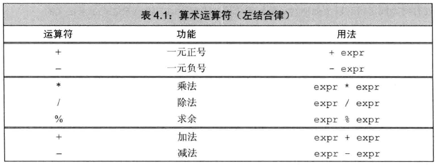
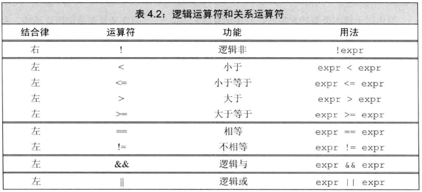

# 表达式 #

表达式由一个或多个**运算对象operand**组成，对表达式求值将得到一个**结果result**。

字面值和变量是最简单的**表达式expression**，其结果就是字面值和变量的值。

把一个**运算符operator**和一个或多个运算对象组合起来可以生成较复杂的表达式。

## 基础 ##

### 基础概念 ###

C++定义了

- 一元运算符unary operator，取地址符&和解引用符*
- 二元运算符binary operator，相等运算符== 乘法运算符*
- 三元运算符ternary operator

一些符号既能做一元运算符也能做二元运算符。如 *

#### 组合运算符和运算对象 ####

- 优先级precedence
- 结合律associativity
- 运算对象的求值顺序order of evaluation

#### 运算对象转换 ####

如，整数，浮点数之间能互相转换。

小整数类型bool,char,short通常会被**提升promoted**成较大的整数类型。

#### 重载运算符 ####

overloaded operator

如IO库>>和<<运算符以及string对象、vector对象和迭代器使用的运算符都是重载运算符。

使用重载运算符时，其包括运算对象的类型和返回值的类型，都是由该运算符定义的；**但是**运算对象的个数、运算符的优先级和结合律都是无法改变的。

#### 左值和右值 ####

rvalue

lvalue

### 优先级与结合律 ###

**复合表达式compound expression**是指含有两个或多个运算符的表达式。

**结合律associativity** 规定具有相同优先级的运算符如何组合在一起。结合律分为左结合律（运算符从左向右组合）和右结合律（运算从右向左组合）。

#### 括号无视优先级与结合律 ####

	// parentheses result in alternative groupings
	cout << (6 + 3) * (4 / 2 + 2) << endl; // prints 36
	cout << ((6 + 3) * 4) / 2 + 2 << endl; // prints 20
	cout << 6 + 3 * 4 / (2 + 2) << endl; // prints 9

#### 优先级与结合律有何影响 ####

优先级体现

	int ia[] = {0,2,4,6,8}; // array with five elements of type int
	int last = *(ia + 4); // initializes last to 8, the value of ia [4]
	last = *ia + 4; // last = 4, equivalent to ia [0] + 4

---

结合律体现

	cin >> v1 >> v2; // read into v1 and then into v2

### 求值顺序 ###

优先级规定了运算对象的组合方式，但是没有说明运算对象按照什么顺序求值。在多数情况下，不会明确指定求值顺序。

**建议：处理复合表达式**

以下两条经验准则对书写复合表达式有益：

1. 拿不准的时候最好**用括号**来强制让表达式的组合关系符合程序逻辑的要求。
2. 如果改变了某个运算对象的值，在表达式的其他地方不要再使用这个运算对象。（例外：`*++iter`）

## 算术运算符 ##

	int i = 1024;
	int k = -i; // i is -1024
	bool b = true;
	bool b2 = -b; // b2 is true!<---注意

**溢出**

	short short_value = 32767; // max value if shorts are 16 bits
	short_value += 1; // this calculation overflows

	//short_value: -32768
	cout << "short_value: " << short_value << endl;

---

整数相除，若商有小数部分，小数部分会截断

	int ival1 = 21/6; // ival1 is 3; result is truncated; remainder is discarded
	int ival2 = 21/7; // ival2 is 3; no remainder; result is an integral value

%的两个运算对象必须是整数

	int ival = 42;
	double dval = 3.14;
	ival % 12; // ok: result is 6
	ival % dval; // error: floating-point operand

	21 % 6; /* result is 3 */ 21 / 6; /* result is 3 */
	21 % 7; /* result is 0 */ 21 / 7; /* result is 3 */
	-21 % -8; /* result is -5 */ -21 / -8; /* result is 2 */
	21 % -5; /* result is 1 */ 21 / -5; /* result is -4 */

## 逻辑和关系运算符 ##

### 逻辑与&&和逻辑或||运算符 ###

**短路求值short-circuit evaluation**

- The right side of an && is evaluated if and only if the left side is true.
- The right side of an || is evaluated if and only if the left side is false.

	index != s.size() && !isspace(s[index])

只有`index != s.size()`为真时，才开始计算`!isspace(s[index])`

---

	// note s as a reference to const; the elements aren't copied and can't be changed
	for (const auto &s : text) { // for each element in text
		cout << s; // print the current element
		// blank lines and those that end with a period get a newline
		if (s.empty() || s[s.size() - 1] == '.')
			cout << endl;
		else
			cout << " "; // otherwise just separate with a space
	}

内的`if (s.empty() || s[s.size() - 1] == '.')`，当`s.empty()`为真时，就没必要再计算`s[s.size() - 1] == '.'`

**值得注意的是**，s被声明成了对常量的引用。因为text的元素是string对象，可能非常大，所以将s声明成引用类型可以避免对元素的拷贝；又因为不需要对string对象做写操作，**所以s被声明成对常量的引用**。

### 逻辑非!运算符 ###

将运算对象的值取反后返回 

	// print the first element in vec if there is one
	if (!vec.empty())
		cout << vec[0];

`!vec.empty()`表达式当`empty()`真时，为假。

### 关系运算符 ###

	// oops! this condition compares k to the bool result of i < j
	if (i < j < k) // true if k is greater than 1!

	// ok: condition is true if i is smaller than j and j is smaller than k
	if (i < j && j < k) { /* ... */ }

### 相等性测试与布尔字面值 ###

	if (val) { /* ... */ } // true if val is any nonzero value
	if (!val) { /* ... */ } // true if val is zero

	//这写法比较冗余，另外，若val不是布尔值，就失去原来的意义
	if (val == true) { /* ... */ } // true only if val is equal to 1!

进行比较运算时除非比较的对象是布尔类型，否则不要使用布尔字面值true和false作为运算对象。

## 赋值运算符 ##

赋值运算符的左侧运算对象必须是一个可修改的左值。

	int i = 0, j = 0, k = 0; // initializations, not assignment
	const int ci = i; // initialization, not assignment

下面的非法：

	1024 = k; // error: literals are rvalues
	i + j = k; // error: arithmetic expressions are rvalues
	ci = k; // error: ci is a const (nonmodifiable) lvalue

C++11新标准允许使用花括号起来的初始值列表作为赋值语句右侧运算对象：

	k = {3.14}; // error: narrowing conversion
	vector<int> vi; // initially empty
	vi = {0,1,2,3,4,5,6,7,8,9}; // vi now has ten elements, values 0 through 9

### 赋值运算满足右结合律 ###

	int ival, jval;
	ival = jval = 0; // ok: each assigned 0

对于多重赋值语句中的每一个对象，它的类型或者与由边对象的类型相同、或者可由对象的类型转换得到。

	int ival, *pval; // ival is an int; pval is a pointer to int
	ival = pval = 0; // error: cannot assign the value of a pointer to an int
	string s1, s2;
	s1 = s2 = "OK"; // string literal "OK" converted to string

### 赋值运算优先级较低 ###

	// a verbose and therefore more error-prone way to write this loop
	int i = get_value(); // get the first value
	while (i != 42) {
		// do something ...
		i = get_value(); // get remaining values
	}

精简成下面那样

	int i;
	// a better way to write our loop---what the condition does is now clearer
	while ((i = get_value()) != 42) {
		// do something ...
	}

因为赋值运算符的优先级低于关系运算符的优先级，所以在条件语句中，赋值部分通常应该加上括号。

### 切勿混淆相等运算符和赋值运算符 ###

	if (i = j)//

	if (i == j)

### 复合赋值运算符 ###

	+= -= *= /= %= // arithmetic operators
	<<= >>= &= ^= |= // bitwise operators;

任意一种复合运算符都等价于

	a = a op b;

用例

	int sum = 0;
	// sum values from 1 through 10 inclusive
	for (int val = 1; val <= 10; ++val)
		sum += val; // equivalent to sum = sum + val

## 递增和递减运算符 ##

有两种版本：前置和后置

	int i = 0, j;
	j = ++i; // j = 1, i = 1: prefix yields the incremented value
	j = i++; // j = 1, i = 2: postfix yields the unincremented value

**建议**：除非必须，否则不用递增递减运算符的后置版本。

前置版本的递增运算符避免了不必要的工作，它把值加1后直接返回改变了的运算对象。与之相比，后置版本需要将原始值存储下来以便于返回这个未修改的内容。如果不需要修改前的值，那么后置版本的操作就是一种浪费。

### 在一条语句中混用解引用和递增运算符 ###

	auto pbeg = v.begin();
	// print elements up to the first negative value
	while (pbeg != v.end() && *beg >= 0)
		cout << *pbeg++ << endl; // print the current value and advance pbeg

`*pbeg++`

**后递增运算符**的优先级高于**解引用运算符**，因此`*pbeg++`等价于`*(pbeg++)`。

`pbeg++`把pbeg的值加1，然后返回pbeg的初始值的副本作为其求值结果，此时解引用运算符的运算对象是pbeg未增加之前的值。

最终，1.这条语句输出pbeg开始时指向的那个元素，并2.将指针指向前移动一个位置。

**建议**：简洁可以成为一种美德

	cout << *iter++ << endl;
	
	cout << *iter << endl;
	++iter;

### 运算对象可按任意顺序求值 ###

大多数运算符都没有规定运算对象的求值顺序

	for (auto it = s.begin(); it != s.end() && !isspace(*it);
	++it)
		*it = toupper(*it); // capitalize the current character

---

	// the behavior of the following loop is undefined!
	while (beg != s.end() && !isspace(*beg))
		*beg = toupper(*beg++); // error: this assignment is undefined

`*beg = toupper(*beg++)`该赋值语句是未定义的。编译器可能按照下面的任意一种思路处理该表达式：

	*beg = toupper(*beg); // execution if left-hand side is evaluated first
	*(beg + 1) = toupper(*beg); // execution if right-hand side is evaluated first

## 成员访问运算符 ##

点运算符和箭头运算符都可用于访问成员

	ptr->mem 等价于(*ptr).mem

---

	string s1 = "a string", *p = &s1;
	auto n = s1.size(); // run the size member of the string s1
	n = (*p).size(); // run size on the object to which p points
	n = p->size(); // equivalent to (*p).size()

解引用运算符的优先级低于点运算符，所以执行解引用运算的子表达式两端**必须**加上括号。

	// run the size member of p, then dereference the result!
	*p.size(); // error: p is a pointer and has no member named size

## 条件运算符 ##

## 位运算符 ##

## sizeof运算符 ##

## 逗号运算符 ##

## 类型运算 ##

### 算术转换 ###

### 其他隐式类型转换 ###

### 显式转换 ###

## 运算符优先级 ##

